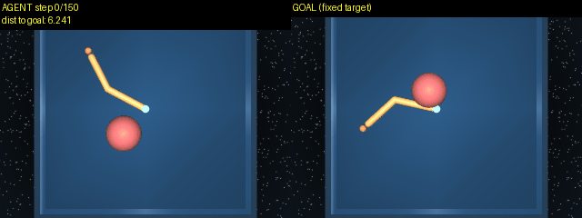

# tinypan

Reproduction of the goal-conditioned RL method from Pantograph's research ([pantograph.com/journal/pan-1](https://pantograph.com/journal/pan-1)): a value function learned from reward-free exploration data by contrastive learning, then a policy extracted from it by advantage-weighted regression. No environment reward is read, ever.

Next: scale this toward a tiny goal-conditioned Minecraft agent. DeepMind Control is the validation ground first, cheap to iterate on before anything that large.


Agent (left) driving toward a goal state (right, fixed), picked after the fact from a random exploration trajectory.

## How it works

Trained on trajectories from a reward-free exploration policy: random actions on dm_control tasks, plus push_t through a different physics engine. No reward is ever read.

**Stage 1** learns a value function, no actions involved. A goal for state $s_t$ is a later state from the same trajectory, $g = s_{t+\Delta}$, $\Delta \sim \text{Geom}(1-\gamma)$; that sampling implements the discount $\gamma$. Two encoders, shared trunk, separate final layers, map states and goals into one embedding space:

$$V_\theta(s, g) = \frac{f_\theta(s) \cdot h_\theta(g)}{\sqrt{d}}$$

Untied on purpose: tying them forces $V_\theta$ symmetric, and reachability isn't (a walker falls easier than it rises). Contrastive loss over a batch of $B$ pairs: only the diagonal of $M_{ij} = V_\theta(s_i, g_j)$ is real, every other goal in the batch is a negative:

$$\mathcal{L}_1 = -\frac{1}{2B}\sum_{i=1}^{B}\left[\log\frac{e^{M_{ii}}}{\sum_j e^{M_{ij}}} + \log\frac{e^{M_{ii}}}{\sum_j e^{M_{ji}}}\right]$$

**Stage 2** freezes $\theta$, no gradient crosses back. For a recorded transition $(s_t, a_t, s_{t+1})$ and a hindsight goal $g$, the frozen value scores whether $a_t$ helped or hurt:

$$A(s_t, a_t, g) = V_\theta(s_{t+1}, g) - V_\theta(s_t, g), \qquad w = \min\left(e^{A/\beta},\ w_{\max}\right)$$

A new policy is trained by weighted regression against the action actually taken:

$$\mathcal{L}_2 = w \cdot \lVert \pi_\psi(s_t, g) - a_t \rVert^2$$

$\beta \to \infty$ collapses every weight to 1: plain behavior cloning, the baseline every result below is measured against.

```
random rollout ──dm_control / gym-pusht──▶ (s, a, s') buffer           collect.py
(s, g) hindsight pairs ──InfoNCE──▶ V_theta(s, g)                      train.py, stage 1
(s, a, s', g) + frozen V_theta ──AWR──▶ pi_psi(s, g)                   train.py, stage 2
pi_psi + goal ──rollout──▶ side-by-side video, live distance overlay   render.py
```

Encoders and policy are small MLPs: 256-unit, 2-layer trunk, 64-dim embedding. Nothing exotic in the architecture; the method is entirely in how data gets relabeled and weighted, not the model.

## Results

| task | success rate | vs. plain imitation |
|---|---|---|
| reacher, arm reaching | 0.75 | 3.75x |
| point_mass_maze, forced detour | 0.55 | 2.25x |
| manipulator, pick and place | 0.40 | 2.67x |
| finger, spin | 0.30 | 2x |
| cartpole, balance | 0.35 | 1.17x |
| pendulum, swingup | 0.40 | ties |
| ball_in_cup, catch | 0.20 | ties |
| point_mass, open plane | 0.30 | slightly behind |
| push_t, block pushing | 0.02-0.03 | both fail |
| walker, standing | 0.05 | both fail |

Value-guided extraction wins clearly wherever the buffer has real variety in path quality (the maze's detour, manipulator's and finger's varied outcomes). Where trajectories are already uniform (point_mass, pendulum, ball_in_cup) it roughly ties imitation, expected rather than a weakness: hindsight-relabeled imitation is already strong when there's nothing to discriminate between.



Strongest single result: an arm configuration it was never told to reach.

Success means staying under a distance threshold for most of a trailing window, not the last frame, not one lucky pass-through. Distance is standardized per dimension first: an early version measured raw distance and let one high-variance dimension (a chaotic velocity, an unbounded angle) dominate the whole comparison. Fixing that flipped several domains from apparent failure to real success; reacher went 0.00 to 0.75 on the identical policy, just measured correctly.


Largest single-change win: holding each action for 5 steps during collection took pick-and-place from 0.00 to 0.40, beating imitation on the same data. Random torque on an arm this size rarely commits to pushing anything in particular; holding the action longer lets it actually move the block. The same trick cuts the other way on reflex tasks: ball_in_cup dropped 0.20 to 0.05, since catching needs correction right at contact, which a held action removes. No way to know in advance which regime a task is in, has to be tried both ways.

Walker and push_t stay near-total failures under every strategy tried: random, action-repeated, and a from-scratch RND policy with one-step-lookahead novelty seeking. More data didn't help either, push_t checked at 4x collection with no change. Both need multi-step credit assignment, crouching before standing, aiming before pushing, that nothing myopic here can represent. Needs real RL-trained exploration, not a parameter sweep.


`point_mass_maze` adds real walls to dm_control's point mass: contacts are disabled by default there (the arena boundary is decorative), so this re-enables contacts and patches in two wall geoms. The heatmap is stage 1's correctness gate: $V_\theta(\cdot,g)$ for a fixed goal, peaking there and decaying outward, checked for asymmetry against $V_\theta(g,s)$, since reachability through a wall isn't symmetric like Euclidean distance.

## Setup

```bash
pip install jax flax optax dm_control numpy matplotlib tqdm imageio imageio-ffmpeg pillow
pip install gym-pusht "pymunk<7"   # only for push_t
```

```bash
pip install -U "jax[cuda12]"   # on a CUDA machine, instead of plain jax
```

```bash
export XLA_PYTHON_CLIENT_PREALLOCATE=false   # on a shared GPU; jax preallocates most of the card otherwise
```

`dm_control`/`mujoco` need prebuilt wheels; conda on Python 3.11 is reliable, a plain `venv` can try building `labmaze` from source and fail. Headless rendering: `MUJOCO_GL=egl`.

## Usage

```bash
python collect.py --domain point_mass --task easy --episodes 2000 --episode-length 200 \
    --out data/point_mass_easy.npz

python train.py --data data/point_mass_easy.npz --out-dir runs/point_mass_easy

python render.py --data data/point_mass_easy.npz --run runs/point_mass_easy --episodes 3
```

## Parameters

| param | default | what it controls |
|---|---|---|
| `episodes` / `episode_length` | 2000 / 200 | size of the collected exploration buffer |
| `action_repeat` | 1 | hold each action for k steps; helps sustained-commitment tasks, hurts reflexive ones |
| `exploration` | `random` | or `rnd`, a novelty-seeking policy that is myopic and can hurt tasks needing stillness |
| `gamma` | 0.95 | discount, implemented through the geometric goal-sampling distribution |
| `dim` | 64 | embedding size |
| `hidden` / `depth` | 256 / 2 | encoder and policy network size |
| `batch_size` | 512 | contrastive batch size; larger means harder negatives |
| `stage1_steps` / `stage2_steps` | 20000 / 20000 | training steps per stage |
| `lr` | 3e-4 | learning rate |
| `beta` | 3.0 | AWR temperature; lower is more selective, `inf` is plain imitation. No fixed value works everywhere |
| `w_max` | 20 | caps how much weight any single transition can carry |
| `held_out_frac` | 0.05 | fraction of episodes reserved as eval-only goals |
| `eval_episodes` / `eval_horizon` | 20 / 200 | goals tested, and steps allowed per attempt |
| `eval_tail` / `eval_tail_frac` | 20 / 0.8 | success needs the threshold held for at least 80% of the last 20 steps |
| `success_threshold` | 2.0 | distance cutoff, in per-dimension-std units |
| `seed` | 0 | fixes everything; same seed reproduces the same run exactly |
