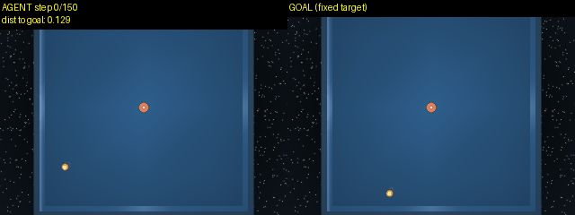
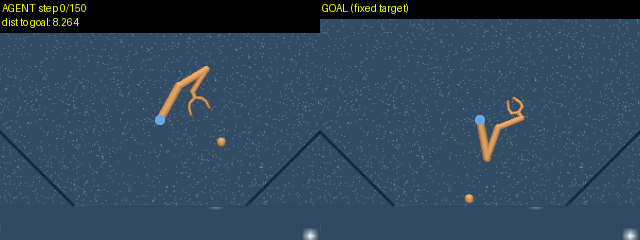
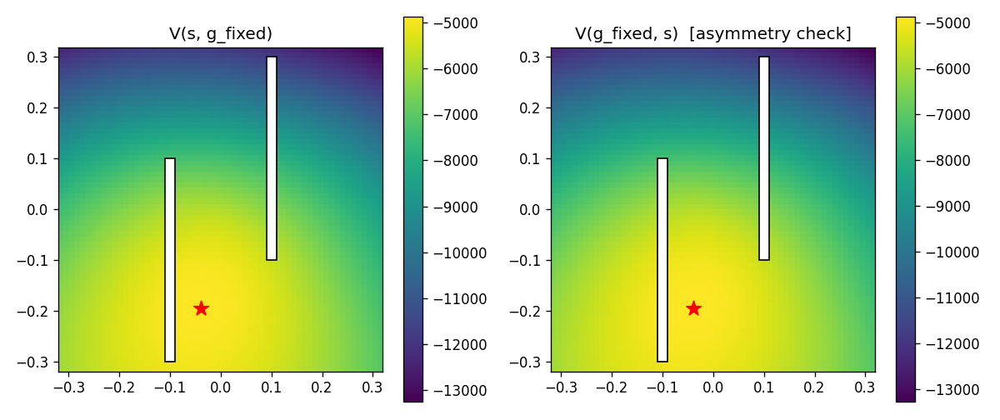

# tinypan

A JAX implementation of contrastive goal-conditioned RL. It learns a value function from reward-free exploration data using contrastive representation learning, then extracts a goal-conditioned policy from that value function by advantage-weighted regression. No environment reward is read at any point. Tested on DeepMind Control. The next step is Minecraft.



*The agent (left) drives toward a goal state (right, fixed) that was never labeled as a goal during training.*

## Results

| domain / task | success rate | vs. plain imitation (BC) |
|---|---|---|
| `reacher` / `easy` | 0.75 | 3.75x better (BC 0.20) |
| `point_mass_maze` / `easy` | 0.55 | 2.25x better (BC 0.20) |
| `pendulum` / `swingup` | 0.40 | ties BC (0.40) |
| `manipulator` / `bring_ball` (pick and place) | 0.40 | 2.67x better (BC 0.15) |
| `finger` / `spin` | 0.30 | 2x better (BC 0.15) |
| `cartpole` / `balance` | 0.35 | modest, 1.17x (BC 0.30) |
| `point_mass` / `easy` | 0.30 | ties, BC slightly ahead (BC 0.35) |
| `ball_in_cup` / `catch` | 0.20 | ties BC (0.20) |
| `push_t` / `push` | 0.02 | near-total failure for both (BC 0.00), see below |
| `walker` / `walk` | 0.05 | dead end, see [FINDINGS.md](FINDINGS.md) |

Every row now has a BC number next to it. The pattern holds up: value-guided extraction wins clearly (reacher, maze, manipulator, finger), ties (pendulum, point_mass, ball_in_cup, roughly), or fails for both methods (push_t).

`cartpole` / `swingup` scored 0.75 in an earlier version of this table. It is left out here: random exploration never once got the pole upright in 400,000 collected transitions, so the number measures reaching a variety of near-bottom resting poses, not swinging up. Kept as a cautionary example in FINDINGS.md.

`push_t` is not a DeepMind Control domain. It is the pushing task from the Diffusion Policy paper, run through `gym-pusht`, a different physics engine (pymunk, 2D) with a Gymnasium API instead of dm_control's. An adapter in `collect.py` presents it with a dm_control-shaped interface so the rest of the code did not need to change. Detail in FINDINGS.md.

Full experiment log and every dead end: [FINDINGS.md](FINDINGS.md).



*Manipulator / bring_ball. One change, `action_repeat=5` during data collection, took this from 0.00 to 0.40. Detail in FINDINGS.md.*



*Correctness check for stage 1 on `point_mass_maze`. The learned value peaks at the goal (red star) and decays outward. Comparing `V(s,g)` against `V(g,s)` checks that the value function can represent asymmetry.*

## How it works

**Stage 1: contrastive value learning.** No actions, no reward. For a state `s` and a hindsight goal `g` (whatever state the trajectory reached some number of steps later, sampled with a geometric distribution), train two encoders on a shared trunk with untied heads:

```
V_theta(s, g) = <f_theta(s), h_theta(g)> / sqrt(d)
```

Fit with a symmetric InfoNCE loss over a batch score matrix; the other goals in the batch are the negatives. The heads are untied on purpose. Tying them forces `V = FF^T`, which is symmetric by construction, and real reachability is not symmetric (a walker falls more easily than it rises).

**Stage 2: advantage-weighted action decoding.** Theta is frozen here. No gradient crosses back into it.

```
A(s, a, g) = V_theta(s', g) - V_theta(s, g)          # frozen theta, stop-gradient
weight     = min(exp(A / beta), w_max)
loss       = weight * || pi_psi(s, g) - a ||^2
```

`beta -> inf` collapses this to plain goal-conditioned behavior cloning. That is the baseline everything in the results table is compared against.

```
data --> STAGE 1 (train encoders f, h) --> theta
                                              |
                                    ==== FROZEN HERE ====
                                              |
data --> [frozen f, h] --> advantage --> weight --+
                                                    v
                    (s, g) --> [policy net] --> weighted regression loss --> psi
```

## Parameters

| param | default | what it controls |
|---|---|---|
| `episodes` / `episode_length` | 2000 / 200 | size of the collected exploration buffer |
| `action_repeat` | 1 | hold each action for k steps. Helps tasks that need sustained commitment, hurts ones that need fast reflexes |
| `exploration` | `random` | or `rnd`, a novelty-seeking policy. See FINDINGS.md for when it backfires |
| `gamma` | 0.95 | discount. Controls how far ahead hindsight goals get sampled from |
| `dim` | 64 | size of the state/goal embedding |
| `hidden` / `depth` | 256 / 2 | encoder and policy network size |
| `batch_size` | 512 | contrastive batch size. Bigger means harder negatives |
| `stage1_steps` / `stage2_steps` | 20000 / 20000 | training steps per stage |
| `lr` | 3e-4 | learning rate |
| `beta` | 3.0 | AWR temperature. Lower is more selective about which transitions to imitate. `inf` is plain BC. No fixed value works everywhere, sweep it per domain |
| `w_max` | 20 | caps how much any single transition's weight can dominate |
| `held_out_frac` | 0.05 | fraction of episodes reserved as eval-only goals |
| `eval_episodes` / `eval_horizon` | 20 / 200 | how many goals are tested, and how long the policy gets per attempt |
| `eval_tail` / `eval_tail_frac` | 20 / 0.8 | success means within threshold for at least 80% of the last 20 steps. Sustained proximity, not a lucky pass-through |
| `success_threshold` | 2.0 | distance under which a state counts as close enough, in per-dimension-std units |
| `normalize_eval_distance` | on | divides each observation dimension by its buffer std before measuring distance, so one high-variance dimension cannot dominate |
| `seed` | 0 | same seed reproduces the same run exactly |

## Setup

```bash
pip install jax flax optax dm_control numpy matplotlib tqdm imageio imageio-ffmpeg pillow
pip install gym-pusht "pymunk<7"   # only needed for the push_t domain
```

On a CUDA machine, install the GPU wheel instead of plain `jax`:

```bash
pip install -U "jax[cuda12]"
```

On a shared GPU, set this. JAX preallocates most of the card by default regardless of how little the model needs:

```bash
export XLA_PYTHON_CLIENT_PREALLOCATE=false
```

## Usage

```bash
# 1. collect a reward-free exploration buffer
python collect.py --domain point_mass --task easy --episodes 2000 --episode-length 200 \
    --out data/point_mass_easy.npz

# 2. stage 1, correctness check, stage 2, eval
python train.py --data data/point_mass_easy.npz --out-dir runs/point_mass_easy

# 3. render rollout videos: agent and goal side by side, live distance overlay
python render.py --data data/point_mass_easy.npz --run runs/point_mass_easy --episodes 3
```

## Repo layout

- `collect.py`: reward-free exploration data collection. Also builds `point_mass_maze` by patching real walls into dm_control's own model, and adapts `gym-pusht` for `push_t`.
- `train.py`: the whole method. Sampler, networks, stage 1, stage 2, evaluation.
- `render.py`: rollout video and GIF rendering, with the actual goal state shown side by side.
- `FINDINGS.md`: the full experiment log. Every domain tried, every dead end, why the eval metric needed fixing, and what explains each result.
- `assets/`: demo clips and the stage-1 correctness heatmap.

## Development notes

Trained on an RTX 4090. `dm_control` and `mujoco` need a Python version with prebuilt wheels available; a conda environment with Python 3.11 works reliably (a plain `venv` on some platforms tries to build `labmaze` from source via bazel and fails). Headless rendering uses `MUJOCO_GL=egl`, no X11 display needed.
